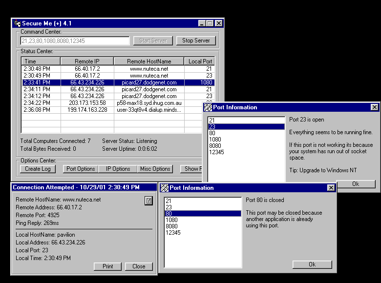



## Secure Me \+ 4\.1 Internet Port Sentry Firewall Type Application\!\! \~\!HOT\!\~

### Description

This is a Must have for Every internet programmer. Secure Me + 4.1 Internet Port Sentry. Firewall type application with advanced options examples using custom parsing, loops, strings, COLLECTIONS, Arrays listboxxes and more See computer Hostnames and IP's as they try to connect to your computer. Get information about them and more. Secure me just keeps improving :)

Vote for me for my effort pls :) Ive come along way since version 1
 
### More Info
 

             |
---                |---
**Submitted On**   |2001-12-07 12:45:30
**By**             |[meth0s](https://github.com/Planet-Source-Code/PSCIndex/blob/master/ByAuthor/meth0s.md)
**Level**          |Intermediate
**User Rating**    |4.4 (22 globes from 5 users)
**Compatibility**  |VB 5\.0, VB 6\.0
**Category**       |[Internet/ HTML](https://github.com/Planet-Source-Code/PSCIndex/blob/master/ByCategory/internet-html__1-34.md)
**World**          |[Visual Basic](https://github.com/Planet-Source-Code/PSCIndex/blob/master/ByWorld/visual-basic.md)
**Archive File**   |[Secure\_Me\_398531262001\.zip](https://github.com/Planet-Source-Code/meth0s-secure-me-4-1-internet-port-sentry-firewall-type-application-hot__1-29525/archive/master.zip)

